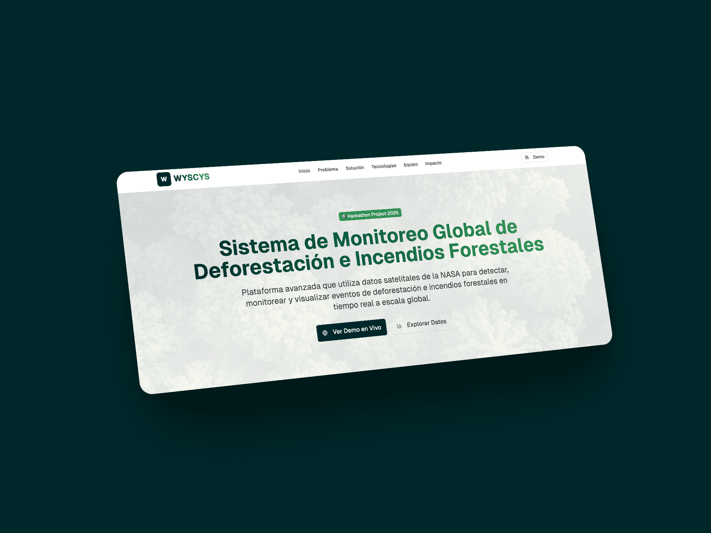

# WYSCYS - Sistema de Monitoreo Global de Deforestación



**WYSCYS** (What You See Can You Save) es una plataforma avanzada de monitoreo forestal que utiliza datos satelitales de la NASA para detectar, monitorear y visualizar eventos de deforestación e incendios forestales en tiempo real a escala global.

> 🌍 Proyecto desarrollado para **Hackathon 2025**

## 🎯 Descripción del Proyecto

Este proyecto nace como respuesta a la necesidad crítica de herramientas modernas para el monitoreo y protección de los bosques del mundo. Utilizando tecnología satelital de la NASA y un stack web moderno, WYSCYS democratiza el acceso a información crítica sobre el estado de los ecosistemas forestales.

### Problemática

- **Deforestación Acelerada**: Pérdida de 10 millones de hectáreas de bosque anualmente a nivel mundial
- **Incendios Forestales**: Aumento del 75% en incendios forestales en las últimas dos décadas
- **Falta de Monitoreo**: Detección tardía de eventos críticos por falta de sistemas integrados

### Solución

Una plataforma integral que combina:

- 🛰️ Datos satelitales en tiempo real de la NASA (actualizados cada 2 horas)
- 🗺️ Mapas interactivos con visualización geoespacial avanzada
- ⏱️ Actualizaciones automáticas siguiendo los ciclos de captura satelital
- 📊 Análisis temporal y seguimiento de tendencias históricas

## 🚀 Tecnologías

### Frontend

- **Framework**: [Next.js 14](https://nextjs.org/) (App Router)
- **Lenguaje**: [TypeScript 5](https://www.typescriptlang.org/)
- **UI Library**: [React 18](https://react.dev/)
- **Estilos**: [Tailwind CSS 4](https://tailwindcss.com/)
- **Componentes UI**: [shadcn/ui](https://ui.shadcn.com/) (Radix UI)
- **Iconos**: [Lucide React](https://lucide.dev/)
- **Tipografías**: Geist Sans & Geist Mono
- **Formularios**: React Hook Form + Zod
- **Analytics**: Vercel Analytics

### Backend & APIs

- Node.js
- NASA Satellite APIs
- REST APIs
- WebSockets

### Infraestructura

- Vercel
- PostgreSQL
- Redis
- Docker

## 📦 Instalación

### Prerrequisitos

- Node.js 18+
- pnpm (recomendado)

### Pasos

1. Clonar el repositorio:

```bash
git clone https://github.com/tu-usuario/wysycs-frontend.git
cd wysycs-frontend
```

2. Instalar dependencias:

```bash
pnpm install
```

3. Ejecutar el servidor de desarrollo:

```bash
pnpm dev
```

4. Abrir [http://localhost:3000](http://localhost:3000) en tu navegador

## 🛠️ Scripts Disponibles

```bash
pnpm dev      # Inicia el servidor de desarrollo
pnpm build    # Construye la aplicación para producción
pnpm start    # Inicia el servidor de producción
pnpm lint     # Ejecuta ESLint
```

## 📁 Estructura del Proyecto

```
wysycs-frontend/
├── app/                      # Next.js App Router
│   ├── layout.tsx           # Layout raíz con fuentes y Analytics
│   ├── page.tsx             # Landing page principal
│   └── globals.css          # Estilos globales y tema Tailwind
├── components/              # Componentes React
│   ├── ui/                  # Componentes shadcn/ui (auto-generados)
│   └── theme-provider.tsx   # Proveedor de tema
├── lib/                     # Funciones utilitarias
│   └── utils.ts            # Función cn() para merge de clases
├── hooks/                   # Custom React Hooks
│   ├── use-toast.ts        # Hook para notificaciones toast
│   └── use-mobile.ts       # Hook para detección de dispositivos móviles
├── public/                  # Assets estáticos
├── CLAUDE.md               # Instrucciones para Claude Code
├── next.config.mjs         # Configuración de Next.js
├── tailwind.config.ts      # Configuración de Tailwind CSS
├── tsconfig.json           # Configuración de TypeScript
└── package.json            # Dependencias del proyecto
```

## 🎨 Sistema de Diseño

El proyecto utiliza un tema personalizado para monitoreo ambiental con Tailwind CSS v4:

- **Espacio de color**: OKLCH para colores modernos y perceptualmente uniformes
- **Paleta principal**:
  - **Primary**: Deep cyan (`oklch(0.25 0.05 200)`) - Representa el agua y la vigilancia
  - **Accent**: Emerald green (`oklch(0.65 0.15 150)`) - Simboliza los bosques y la naturaleza
  - **Destructive**: Red (`oklch(0.55 0.2 25)`) - Para alertas críticas
- **Modo oscuro**: Soporte completo mediante clase `.dark`

## 🌟 Características Principales

### 1. Visualización de Datos Satelitales

- Integración directa con APIs de la NASA
- Actualización de datos cada 2 horas
- Soporte para múltiples tipos de satélites

### 2. Mapas Interactivos

- Visualización geoespacial avanzada
- Zoom y navegación fluida
- Filtros por tipo de evento y región

### 3. Análisis Temporal

- Seguimiento de tendencias históricas
- Comparación entre períodos
- Exportación de reportes

### 4. Sistema de Alertas

- Notificaciones en tiempo real
- Alertas configurables por región
- Integración con sistemas de emergencia

## 👥 Equipo

- **Ana Martínez** - Full Stack Developer
- **Carlos González** - Data Scientist
- **Laura Rodríguez** - Científica Ambiental
- **Miguel Vargas** - UI/UX Designer

## 🎯 Impacto Esperado

### Para Investigadores

Acceso a datos actualizados para estudios en ciencias ambientales y climáticas

### Para Gobiernos

Herramientas para políticas de protección ambiental y respuesta a emergencias

### Para el Público

Concienciación sobre el estado actual de los bosques y desafíos ambientales

## 🔧 Configuración Avanzada

### Aliases de Import

El proyecto usa aliases de TypeScript configurados en `tsconfig.json`:

```typescript
import { Button } from "@/components/ui/button";
import { cn } from "@/lib/utils";
```

### Agregar Componentes shadcn/ui

```bash
npx shadcn@latest add [component-name]
```

### Variables de Entorno

Crear un archivo `.env.local`:

```env
NEXT_PUBLIC_NASA_API_KEY=tu_api_key
NEXT_PUBLIC_API_URL=https://api.ejemplo.com
```

## 📊 Estado del Proyecto

- ✅ Diseño de UI/UX completado
- ✅ Integración de componentes shadcn/ui
- ✅ Landing page con secciones principales
- 🚧 Integración con APIs de NASA (en progreso)
- 🚧 Implementación de mapas interactivos (en progreso)
- ⏳ Sistema de autenticación (pendiente)
- ⏳ Dashboard de usuario (pendiente)

## 🤝 Contribuir

Este es un proyecto de hackathon, pero las contribuciones son bienvenidas:

1. Fork el proyecto
2. Crea una rama para tu feature (`git checkout -b feature/AmazingFeature`)
3. Commit tus cambios (`git commit -m 'Add some AmazingFeature'`)
4. Push a la rama (`git push origin feature/AmazingFeature`)
5. Abre un Pull Request

## 📝 Licencia

Este proyecto es de código abierto. Ver archivo LICENSE para más detalles.

## 🙏 Agradecimientos

- **NASA** por proporcionar acceso a datos satelitales
- **Vercel** por el hosting y analytics
- **shadcn** por los componentes UI
- Comunidad open source

## 📧 Contacto

Para más información sobre el proyecto:

- **Proyecto**: WYSCYS (What You See Can You Save)
- **Hackathon**: 2025
- **Hashtag**: #ForestWatch #NASA #Hackathon2025

---

<p align="center">
  <strong>🌲 Desarrollado con ❤️ para proteger los bosques del mundo 🌲</strong>
</p>

<p align="center">
  © 2025 Equipo ForestWatch • Powered by NASA Satellite Data • Open Source Project
</p>
